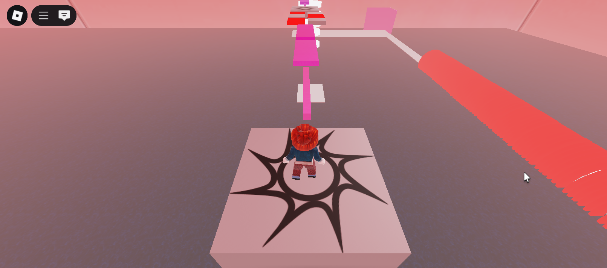
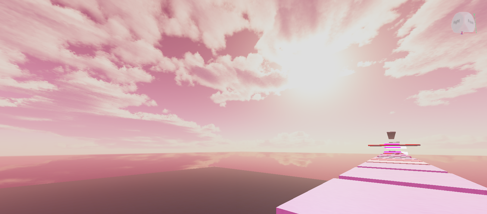
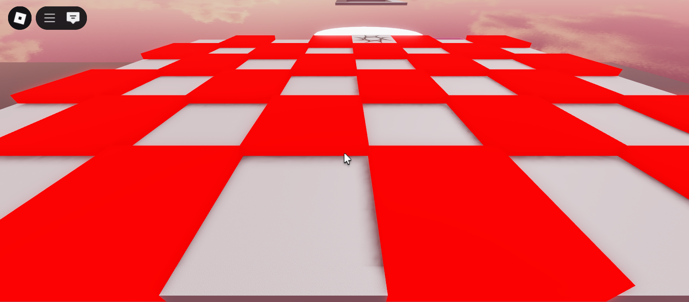
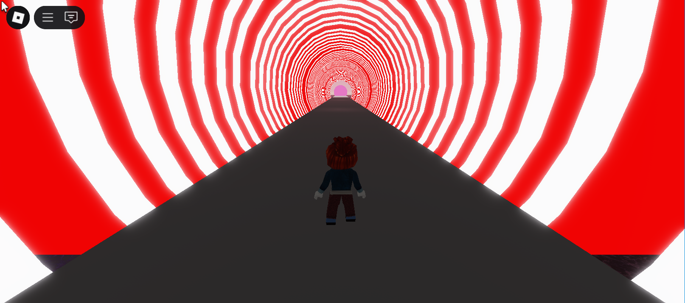

# ⚐ Roblox Obby

A Roblox Studio obby with kill blocks, conveyors, shrinking platforms, and checkpoints—ending with a fun surprise.

## 🔧 Features

- 🔥 Kill Blocks – Step on the wrong block, and you instantly lose!
- 🏃 Conveyor Belts – Speed up, slow down, or get boosted up as the floor moves beneath you.
- ✅ Checkpoints – Save your progress so you don't have to start over.
- 🧱 Dynamic Blocks – Platforms that shrink, grow, and add new challenges.
- 🪜 Stairs, moving parts, and more interactive components.
- 🎉 Cool Ending – A rewarding and exciting experience when you complete the obby.

## 💡 How It Was Made

This obby was coded and designed in **Roblox Studio** using **Lua scripting**. The logic behind kill blocks, size-changing parts, and moving platforms was implemented with custom scripts to enhance the gameplay experience.

## 🚀 How to Play

1. Open Roblox and join the [game](https://www.roblox.com/games/9700632786/yineirys-game).
2. Use the arrow keys to move, the spacebar to jump, and the left mouse button to change your view.
3. Reach each checkpoint to save your progress.
4. Beat the obby and enjoy the ending!

## 📸 Screenshots
<table>
  <tr>
    <th>Game Start</th>
    <th>Terrain</th>
  </tr>
  <tr>
    <td></td>
    <td></td>
  </tr>
  <tr>
    <th>Kill Blocks</th>
    <th>Game Ending</th>
  </tr>
  <tr>
    <td></td>
    <td></td>
  </tr>
</table>
